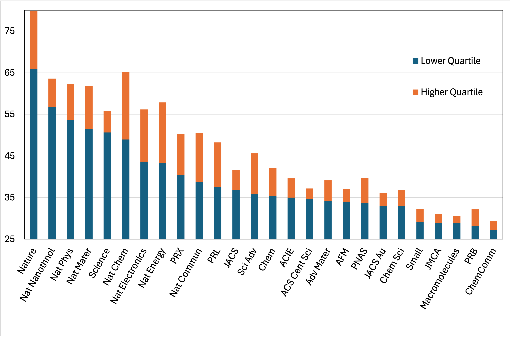

# LLM‑calibrated journal benchmarking for manuscript submission

---
Jiaxuan Li
Cavendish Laboratory, Department of Physics, University of Cambridge
---

## Abstract

Choosing a target journal is a surprisingly difficult part of scientific writing. Most researchers rely on informal advice from supervisors and colleagues, which can be biased or inconsistent, especially for interdisciplinary work that sits between chemistry, solid‑state physics and materials science. Here I explore whether a large language model (LLM) can be used as a calibrated “prestige sensor” for published articles and, by extension, for new manuscripts. I define six prestige levels spanning very top multidisciplinary titles to good narrow‑field journals, prompt the model to estimate the chance that a manuscript is sent out for external review at each level, and then compress these probabilities into a single score. I benchmark 20 recent articles per journal across 26 titles and five LLMs. Raw scores from GPT‑4.1 show an unrealistically large gap between the Nature‑portfolio journals and top field journals, which I trace to the model recognising journal style and metadata. When journal identifiers are stripped and only de‑identified text is scored (GPT‑remove), the distributions become more plausible: the Nature family still sits highest, but the best Nature Communications papers overlap the weaker Nature‑portfolio papers, and journals such as JACS, Advanced Materials, PRX and Sci. Adv. occupy a shared intermediate band. A repeatability test shows that non‑reasoning GPT‑4.1 is far more stable than reasoning models (standard deviation ≈0.9 vs 3.7–4.7 over 100 runs for a single paper). The resulting calibrated score distributions offer a quick, lightweight, and transparent aid to journal selection.

---

## Introduction

Selecting a journal is one of the few strongly consequential decisions in the life of a manuscript that is usually taken on the basis of informal experience. This works reasonably well when everyone involved shares the same disciplinary background, but becomes fragile for work at the boundaries of chemistry, solid‑state physics and materials science, such as conductive metal–organic frameworks or organic semiconductors. In such cases advice from senior colleagues can differ by several perceived “levels”, leading either to months spent on high‑risk submissions or to strong work being placed in conservative venues.

Modern LLMs have ingested much of the published literature and have, implicitly, experienced a vast number of editorial decisions. They are poor oracles of acceptance probabilities, but they can be surprisingly good at relative judgements such as “this looks stronger than that”. The question explored here is whether an LLM, prompted carefully and calibrated using recent published articles, can provide a useful benchmark for where a new manuscript is likely to be at least review‑worthy.

Rather than attempt to predict acceptance, I ask the model to estimate the probability that a manuscript would be sent out for external review at each of six journal‑prestige levels. These probabilities are not what is used, they are instead combined into a single score, which can be compared across manuscripts and journals. By collecting score distributions for a set of well‑known titles, I obtain a data‑driven map of perceived journal difficulty that can be referenced when choosing where to submit.

---

## Methods

### Prestige levels and prompt design

I define six prestige levels by grouping commonly used journals in chemistry, physics and materials science. The groupings are based on informal perceived prestige, collected from ten PhD students and senior researchers across these fields.

**Table 1 | Prestige levels and representative journals.**

| Level | Informal description | Representative journals |
| --- | --- | --- |
| Level 1 | Very top multidisciplinary | *Nature*, *Science* |
| Level 2 | High‑prestige sister titles | *Nature Materials*, *Nature Chemistry*, *Nature Physics*, *Nature Electronics*, *Nature Energy*, *Nature Nanotechnology* |
| Level 3 | Mid‑prestige sisters and equivalents | *Nature Communications*, *Science Advances*, *Joule* |
| Level 4 | Top broad‑field journals | *Journal of the American Chemical Society*, *Advanced Materials*, *Angewandte Chemie International Edition*, *Physical Review Letters*, *Physical Review X*, *PNAS*, *Chem* |
| Level 5 | Strong broad‑field journals and equivalents | *JACS Au*, *Advanced Functional Materials*, *Advanced Energy Materials*, *CCS Chemistry*, *Chemical Science*, *ACS Central Science*, *Advanced Science*, *Energy & Environmental Science*, *Physical Review B* |
| Level 6 | Good narrow‑field journals | *Journal of Materials Chemistry A*, *Small*, *Chemical Communications*, *Macromolecules*, *Advanced Electronic Materials*, *Journal of Physical Chemistry Letters*, *Journal of Physical Chemistry A*, *ACS Applied Materials & Interfaces* |

For each manuscript, the LLM is given only the scientific text (see below) together with this six‑level ladder. It is asked:

> “Provide your educated guess — expressed as a percentage — for the chance this manuscript would be sent for external review at each of the six levels, assuming it is within scope. Probabilities must be monotonic with level: it should never be harder to be reviewed at a lower‑prestige level than at a higher one.”

The model outputs six integers between 0 and 100 (“Level 1” to “Level 6”), together with a brief justification.

### Composite score

To obtain a single number per manuscript, I form a weighted average of the six level‑probabilities

$$
S = \frac{2p_1 + 2p_2 + p_3 + p_4 + p_5 + p_6}{8},
$$

where \(p_i\) is the predicted review probability at level \(i\). This slightly emphasises the top two levels while keeping contributions from the rest. Intuitively, a manuscript that looks borderline for Level 2 but safe for Level 4 will score higher than one that is only safe at Level 5–6.

For each manuscript and model, I draw up to 20 scores. Only samples that satisfy the monotonicity constraint across levels are retained. The final score for that manuscript is taken as the interquartile mean (the mean after trimming away values outside the 25th–75th percentile), which reduces the influence of occasional erratic outputs and accounts for expected LLM variation.

### Manuscript set

For each journal, I collect 20 of the most recent research articles in concerned areas overlapping materials chemistry, solid‑state physics and materials science. Some notable areas that are excluded include: organic synthsis, energy-related applications/management, biology and biomaterials, purely theoretical articles, etc. For journals that are not fully open access, I restrict to open‑access articles. Editorials, reviews, short commmunications, and perspectives are excluded.

This yields 26 journals spanning Levels 1–6, with 20 articles per journal.

### Models and de‑identification

I test both “reasoning” and “non‑reasoning” models from several providers. The main non‑reasoning models are GPT‑4.1 and Gemini 2.5 Flash; DeepSeek V3 (DSV) and Baidu Ernie 4.5 are included as additional baselines. Reasoning‑style models (such as DeepSeek R1 and OpenAI’s o3/o4‑mini) are used only in a small consistency test.

A key question is whether the LLM is genuinely judging scientific quality or simply recognising journal style and metadata. I therefore run GPT‑4.1 in two modes:

1. **GPT‑4.1 (raw):** manuscripts are provided with their original abstract and front‑matter, which often includes journal names, DOIs and characteristic phrasing.
2. **GPT‑remove:** a preprocessing script removes explicit journal identifiers (names, abbreviations, DOIs, publisher names and URLs) and applies simple regular expressions to delete or neutralise formulaic phrases strongly associated with specific publishers. The scientific content is left intact.

Unless otherwise stated, results labelled GPT‑remove refer to GPT‑4.1 evaluated on these de‑identified texts.

### Consistency experiment

To assess run‑to‑run variability, I select a single representative manuscript and score it 100 times with GPT‑4.1 and three reasoning models: o4‑mini, o3 and DeepSeek R1. The same prompt and monotonicity filter are used, and standard deviations and interquartile ranges of the composite score are compared.

---

## Results

### Raw GPT‑4.1 scores exaggerate the gap between Nature and field‑top journals

When GPT‑4.1 is used directly on unmodified abstracts with journal information present, the median composite scores for recent papers show a striking separation:

- *Nature* articles cluster near the top of the scale, with a median score of 97.2.
- *Science* sits lower at 73.0.
- The main Nature‑portfolio journals (*Nature Materials*, *Nature Chemistry*, *Nature Physics*, *Nature Nanotechnology*, *Nature Energy*, *Nature Electronics*) fall in the 59–70 range.
- Top field journals such as JACS, *Advanced Materials*, *Angewandte Chemie*, *PRX*, *PRL* and *Chem* all sit around 38–47.
- Good broad‑ and narrow‑field journals (*Chemical Science*, *ACS Central Science*, *Advanced Functional Materials*, *PRB*, *JMCA*, *Macromolecules*) lie in the low 30s.

The relative ordering broadly agrees with informal expectations (for example JACS scores higher than JACS Au, *Advanced Materials* higher than *Advanced Functional Materials*), but the magnitude of the gap between the Nature‑portfolio journals and field‑top titles appears unrealistically large. For example, there is a huge gap between *Nature Materials* or *Nature Chemistry* and to JACS or *Advanced Materials*, which is unlikely to reflect actual editorial difficulty.

### De‑identification compresses the Nature gap and aligns Nature Communications with near‑misses

After removing journal identifiers and obvious stylistic markers (GPT‑remove), the distributions change substantially. Table 2 shows the resulting medians and interquartile ranges for GPT‑remove across the 26 journals.

**Table 2 | GPT‑remove composite score statistics by journal.**  
Scores are composite values \(S\) in the range 0–100. Q1 and Q3 denote the 25th and 75th percentiles.

| Journal | median | Q1 | Q3 |
| --- | --- | --- | --- |
| Nature | 72.3 | 65.8 | 79.8 |
| Nat Nanothnol | 59.3 | 56.8 | 63.6 |
| Nat Phys | 58.3 | 53.6 | 62.2 |
| Nat Mater | 56.7 | 51.5 | 61.8 |
| Science | 54.5 | 50.6 | 55.8 |
| Nat Chem | 56.3 | 49.0 | 65.2 |
| Nat Electronics | 52.1 | 43.6 | 56.2 |
| Nat Energy | 55.2 | 43.3 | 57.9 |
| PRX | 44.8 | 40.4 | 50.2 |
| Nat Commun | 41.1 | 38.8 | 50.5 |
| PRL | 40.5 | 37.6 | 48.2 |
| JACS | 38.6 | 36.8 | 41.6 |
| Sci Adv | 39.7 | 35.8 | 45.6 |
| Chem | 38.0 | 35.3 | 42.1 |
| ACIE | 37.7 | 35.0 | 39.6 |
| ACS Cent Sci | 35.7 | 34.6 | 37.2 |
| Adv Mater | 37.6 | 34.1 | 39.1 |
| AFM | 35.8 | 34.0 | 37.0 |
| PNAS | 36.5 | 33.6 | 39.7 |
| JACS Au | 34.4 | 33.0 | 36.0 |
| Chem Sci | 35.1 | 32.9 | 36.8 |
| Small | 30.5 | 29.2 | 32.3 |
| JMCA | 30.2 | 28.9 | 31.0 |
| Macromolecules | 29.5 | 28.9 | 30.6 |
| PRB | 30.8 | 28.2 | 32.2 |
| ChemComm | 28.2 | 27.2 | 29.3 |

Several patterns emerge.

First, the Nature‑portfolio journals are still clearly distinguished from field‑top titles, but they no longer live on a separate scale. *Nature* has a median score of 72.3, with Q1–Q3 spanning 65.8–79.8. The various Nature‑portfolio journals cluster between about 52 and 59, with reasonable overlap.

Second, *Nature Communications* and *Science Advances* now occupy a band whose upper quartiles overlap with the lower quartiles of *Nature Chemistry*, *Nature Physics*, *Nature Energy* and *Nature Electronics*. For example, the upper quartile of *Nature Communications* (50.5) almost coincides with the lower quartile of *Nature Chemistry* (49.0), and sits only a little below the lower quartile of *Nature Physics* (53.6). This is consistent with the intuition that many *Nature Communications* papers are near misses from the more specialist Nature titles.

Third, top field‑journals such as JACS, *Advanced Materials*, ACIE, *PRX*, *PRL*, *Chem*, *Sci. Adv.* and PNAS form a broad plateau in the high 30s to mid‑40s. Journals like *Advanced Functional Materials*, *Chemical Science* and *ACS Central Science* sit just below but clearly above narrow‑field titles such as *Journal of Materials Chemistry A*, *PRB* and *ChemComm*.

Figure 1 sketches these distributions, revealing a smooth ladder from *Nature* down to specialist journals with overlapping bands rather than sharp cliffs.

### Different models agree on ordering but differ in scale

To examine model dependence, I compute median scores for a subset of journals across GPT‑4.1 (raw), GPT‑remove, Gemini 2.5 Flash, DeepSeek V3 (DSV) and Baidu Ernie 4.5. Table 3 shows a condensed view.

**Table 3 | Median composite scores for selected journals across models.**

| Journal | GPT_4.1 | GPT_remove | Gemini | DSV | Baidu |
| --- | --- | --- | --- | --- | --- |
| Nature | 97.2 | 72.3 | 98.2 | 96.0 | 94.7 |
| Nat Mater | 69.7 | 56.7 | 89.2 | 62.4 | 73.4 |
| Science | 73.0 | 54.5 | 98.2 | 93.9 | 90.2 |
| Nat Commun | 40.3 | 41.1 | 48.3 | 44.9 | 46.6 |
| JACS | 41.6 | 38.6 | 49.4 | 42.5 | 44.7 |
| Adv Mater | 39.2 | 37.6 | 41.2 | 44.2 | 46.4 |
| Chem Sci | 35.6 | 35.1 | 37.5 | 42.5 | 44.1 |
| AFM | 35.2 | 35.8 | 35.9 | 42.5 | 45.0 |
| JMCA | 29.2 | 30.2 | 24.8 | 40.6 | 40.2 |
| PRB | 29.8 | 30.8 | 24.9 | 34.0 | 32.5 |
| ChemComm | – | 28.2 | 22.5 | 32.5 | 32.5 |

All models agree strongly on the overall ordering of journals: the Pearson correlation between GPT‑4.1 and GPT‑remove medians across 25 journals is 0.98, and correlations between GPT‑4.1 and Gemini, DSV or Baidu all exceed 0.93. However, their scales differ.

Gemini 2.5 Flash saturates the top end: *Nature* and *Science* both sit around 98, and the main Nature‑portfolio journals are pushed into the high 80s to low 90s. This compresses the upper half of the ladder and limits resolution. DSV places *Nature* and *Science* in the mid‑90s, but then compresses many mid‑tier journals (JACS, *Chem. Sci.*, *Chem*, *ACS Cent. Sci.*, CCS Chem) into a narrow band around 42–43. Baidu Ernie 4.5 is particularly bullish on the Nature‑portfolio, with *Nature Nanotechnology*, *Nature*, *Nature Physics* and *Science* all medians above 90 or high 80s.

By contrast, GPT‑remove spreads scores more evenly: only *Nature* sits above 70, while Nature‑portfolio journals occupy the high‑50s band, field‑top journals the high‑30s to mid‑40s, and narrow‑field titles the high‑20s to low‑30s. This, together with its low run‑to‑run variance, makes GPT‑remove the most useful model for calibration.

### Non‑reasoning GPT‑4.1 is much more stable than reasoning models

The consistency test on a single manuscript highlights the difference between non‑reasoning and reasoning models. Over 100 independent runs:

- GPT‑4.1 yields a mean score of 53.3 with a standard deviation of 0.89 and an interquartile range of 1.2.
- o4‑mini has a standard deviation of 3.7 and an interquartile range of 4.2.
- o3 has a standard deviation of 3.8 and an interquartile range of 5.1.
- DeepSeek R1 has a standard deviation of 4.7 and an interquartile range of 5.2.

In other words, reasoning models are three to five times more variable run‑to‑run than GPT‑4.1 on this task. This is unsurprising: chains of reasoning are inherently more stochastic than direct pattern‑matching, and the task here is essentially pattern‑matching to editorial taste. For an automated benchmark, stability is more important than baroque reasoning, so I adopt GPT‑4.1 (with de‑identified text) as the default.

---

## Discussion

The results above suggest that LLMs can provide a useful, calibrated signal about the relative “journal strength” of manuscripts, provided that two conditions are met. First, the model must not be allowed to condition explicitly on journal identifiers or heavily stylised boilerplate text. Second, scores must be interpreted in a relative, distributional sense, rather than as literal probabilities of acceptance.

With those caveats, the GPT‑remove distributions in Table 2 and Figure 1 match common experience reasonably well. *Nature* and its siblings are harder than JACS, *Advanced Materials* or *PRL*, which in turn sit above journals such as *Advanced Functional Materials* and *Chemical Science*, which themselves are usually harder than *JMCA* or *ChemComm*. The interesting part is the quantitative overlap: upper‑quartile *Nature Communications* articles look very similar, to the model, to lower‑quartile *Nature Chemistry* or *Nature Physics* articles. This matches the lived experience that many papers move between these venues during peer review. For example, a significant proportion of the best papers at *Nature Communications* are likely to be near-miss rejections from *Nature Materials*.

How might this be used in practice? One simple procedure is:

1. Score a new manuscript with GPT‑remove using the same prompt and scoring pipeline.
2. Place its composite score on the calibrated distributions for the candidate journals.
3. Prefer journals where the manuscript sits above the lower quartile recent published work. Treat journals where it sits well below as aspirational.

Such a tool is not a replacement for human judgement, but it can act as a sanity check. For example, if a manuscript believed to be “clearly Nature‑level” scores squarely in the JACS/*Advanced Materials* band, that might prompt constructive revision of the narrative or a more modest first target.

There are important limitations. The model evaluates only what is visible in the main text; it cannot see any supplementary information. It is also inevitably affected by training‑set leakage: there are certain writing style and structuring to nature-portfolio journals that may well be spotted and quietly affect the model's judgement. De‑identification mitigates but does not completely resolve this. Additionally, any such calibration is field‑specific: the difficulty of publishing in JACS or PRL is not the same in all subfields, and the present dataset focuses on the broad intersection of chemistry, solid‑state physics and materials science. However, the key takeaway is that **if your manuscript fits the scope and priorities of a journal and is above its score thresholds, there is a realistic probability of it being set for review if submitted**.

Despite these caveats, the exercise shows that an LLM can be turned from a chatty assistant into a reasonably consistent, quantifiable surrogate for “how hard does this look?”. It also reveals where stylistic priors matter: without de‑identification, the model reacts strongly to journal house style and elevates Nature‑portfolio papers beyond what their content alone would justify.

---

## Reproducibility and repository structure

In the accompanying GitHub repository I include:

- The script for batch processing manuscripts including preprocessing.
- The exact prompt used for scoring.
- Raw data (specific scores).

The aim is that anyone working in a neighbouring field can swap in their own set of journals and calibration papers, and obtain a similar set of distributions tailored to their area.

---

## Outlook

This small experiment sits somewhere between bibliometrics and model evaluation. It does not claim that LLMs can or should replace editorial decisions; rather, it shows that they can act as noisy but informative sensors of the kind of patterns that editors and referees already internalise. In a research landscape where multidisciplinary work is common and where “which journal?” remains a routine source of anxiety, even a crude, transparent calibration tool can be helpful.

Future refinements might include topic‑conditioned calibration (separate distributions for, say, MOF transport vs perovskite photovoltaics), explicit debiasing for overly flowery writing, and ensembles of models to give uncertainty bands. For now, GPT‑4.1 with journal‑blind inputs already provides a sufficiently coherent and stable map of the current journal ladder in chemistry, solid‑state physics and materials science, and that is enough to make it a useful part of my own manuscript planning.
